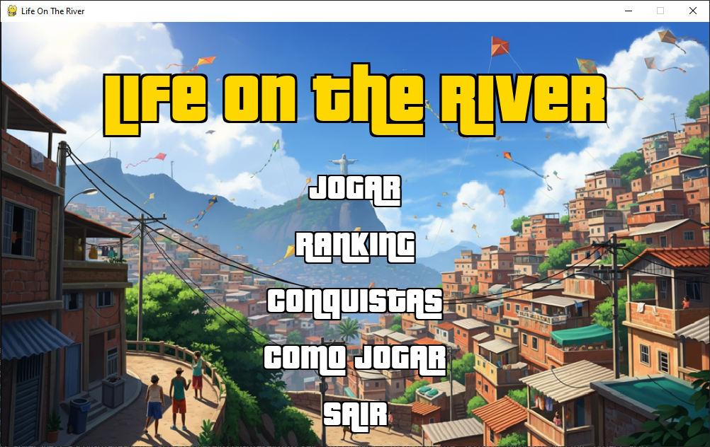
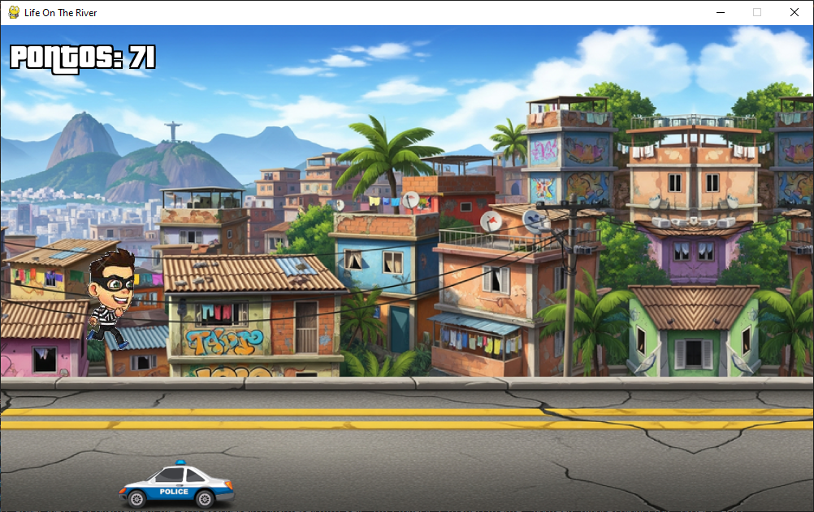
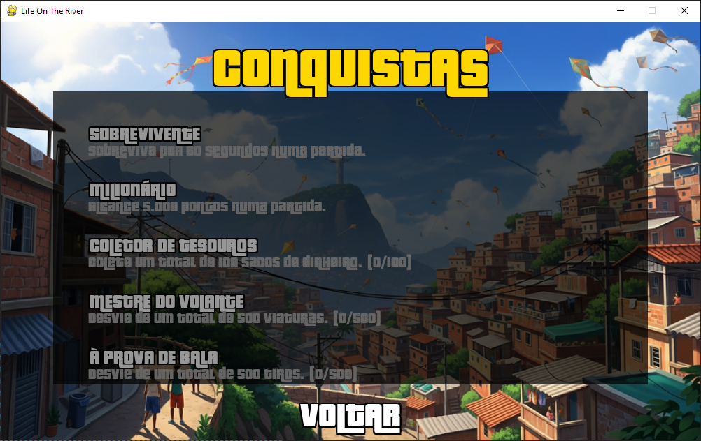

# Life On The River

| Menu | Gameplay | Conquistas |
|:---:|:---:|:---:|
|  |  |  |

Um jogo de corrida infinita em 2D desenvolvido em Python. Assuma o controle de um fugitivo que deve fugir da polícia desviando de obstáculos e coletar sacos de dinheiro para sobreviver o máximo de tempo possível e alcançar a maior pontuação.

---

## ✨ Funcionalidades

* **Jogabilidade Clássica de Corrida Infinita:** Desvie de obstáculos como viaturas, tiros e helicópteros, em um desafio de reflexos e sobrevivência.
* **Progressão de Dificuldade:** A velocidade do jogo aumenta à medida que sua pontuação cresce, tornando o desafio constante.
* **Itens de Bônus:** Colete sacos de dinheiro para um bônus de pontuação que aumenta sua pontuação final.
* **Sistema de Conquistas:** Desbloqueie conquistas por atingir objetivos específicos, como sobreviver por um determinado tempo ou coletar um número de sacos de dinheiro.
* **Ranking Persistente:** Suas pontuações e nome são salvos em um arquivo local para que você possa competir pelo topo do ranking.
* **Interface Gráfica Completa:** Menus bem definidos, tela de "Como Jogar", menu de pausa funcional e tela de "Game Over" para inserir seu nome.
* **Efeitos de Áudio:** Música ambiente e efeitos sonoros para sirenes, tiros e momentos de derrota, criando uma atmosfera imersiva.

---

## 🔧 Tecnologias Utilizadas

* **Linguagem:** Python 3.11
* **Bibliotecas Principais:**
    * [Pygame](https://www.pygame.org/) - A base para toda a lógica de jogo e renderização.
    * [PPlay Game Engine](https://github.com/pplay-gengine/pplay) - Uma biblioteca wrapper sobre o Pygame para facilitar a manipulação de sprites e janelas.

---

## 🚀 Como Executar o Projeto

Siga os passos abaixo para rodar o jogo "Fuga no Rio" na sua máquina local.

### Pré-requisitos

* Python 3.8 ou superior instalado.
* `pip` (gerenciador de pacotes do Python).

### Instalação

1.  **Clone o repositório:**
    ```sh
    git clone https://github.com/MateusFerreiraM/Life_On_The_River.git
    cd Life_On_The_River
    ```

2.  **Crie um Ambiente Virtual (Recomendado):**
    ```sh
    python -m venv venv
    ```
    Ative o ambiente:
    * No Windows: `.\venv\Scripts\activate`
    * No macOS/Linux: `source venv/bin/activate`

3.  **Instale as dependências:**
    As bibliotecas necessárias estão listadas no arquivo `requirements.txt`. Para instalá-las, rode:
    ```sh
    pip install -r requirements.txt
    ```

4.  **Execute o Jogo:**
    Com as dependências instaladas, basta executar o arquivo principal.
    ```sh
    python main.py
    ```

---

## 🎮 Como Jogar

* **Objetivo:** Sobreviver o máximo de tempo possível, desviando dos obstáculos e coletando sacos de dinheiro para conseguir a maior pontuação.
* **Controles:**
    * **Pular:** `Seta para Cima` ou `UP`.
    * **Agachar:** `Seta para Baixo` ou `DOWN`.
    * **Pausar/Voltar ao Menu:** `ESC` durante a partida para abrir o menu de pause.

---

## 📂 Estrutura de Arquivos

O projeto foi organizado de forma modular para facilitar a manutenção e escalabilidade:

```
├── assets/
│   ├── audio/
│   ├── fonts/
│   └── images/
|   └── jogo/
├── achievement_manager.py
├── achievements_scene.py
├── asset_manager.py
├── constants.py
├── entities.py
├── game.py
├── gameplay.py
├── game_over.py
├── instructions_scene.py
├── menu.py
├── notification.py
├── ranking.py
└── requirements.txt

```
---

## 📄 Licença

Este projeto está sob a licença MIT. Veja o arquivo `LICENSE` para mais detalhes.
